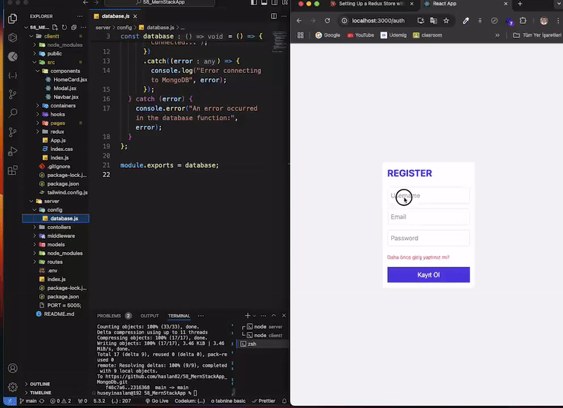

# MERNSTACK_APP

Frontend tarafında React ve Redux kullanılarak geliştirilen, backend tarafında Node.js ve Express ile desteklenen full-stack bir web uygulamasıdır. Kullanıcılar posts paylaşabilir, düzenleyebilir ve silebilir.

### Temel Özellikler:

Kullanıcı Kimlik Doğrulama: JWT token tabanlı güvenli kayıt ve giriş sistemi
Post Yönetimi: Kullanıcılar post oluşturabilir, güncelleyebilir ve silebilir
Arama Özelliği: Paylaşılan içeriklerde arama yapabilme
Modern Arayüz: Tailwind CSS ile responsive ve şık tasarım
Gerçek Zamanlı Bildirimler: React-Toastify ile kullanıcı etkileşimleri

### Teknik Altyapı:

Frontend: React 18, Redux, React Router v7
State Yönetimi: Redux Thunk middleware
Backend: Express.js, MongoDB
Güvenlik: Bcrypt ile şifreleme
API İletişimi: Axios
UI Bileşenleri: React Icons, Tailwind CSS

### Kullanıcı Deneyimi:

Sezgisel arayüz tasarımı
Kolay kayıt ve giriş süreci
Hızlı post oluşturma ve düzenleme
Anlık bildirimler ile geri bildirim
Mobil uyumlu tasarım

Bu uygulama, modern web teknolojilerinin güçlü özelliklerini kullanarak, kullanıcı dostu bir sosyal paylaşım deneyimi sunmaktadır. Özellikle Redux ile state yönetimi ve JWT ile güvenli kimlik doğrulama sistemi, uygulamanın güvenilir ve ölçeklenebilir olmasını sağlamaktadır.

###  Designed by <a href="https://www.linkedin.com/in/h%C3%BCseyin-aslan-128519203/" target="_blank">Hüseyin ASLAN</a> 

### GIF

# JWT (JSON Web Token)

 Web uygulamalarında güvenli bilgi aktarımı için kullanılan açık bir standarttır. 
JWT'nin Yapısı (3 bölümden oluşur):

Header (Başlık)

jsonCopy{
  "alg": "HS256",
  "typ": "JWT"
}

Payload (Veri)

jsonCopy{
  "userId": "123",
  "username": "john_doe",
  "role": "user",
  "exp": 1516239022
}

Signature (İmza)

Header ve payload'ın şifrelenmiş hali
Gizli bir anahtar (secret key) ile oluşturulur

Çalışma Prensibi:

Kullanıcı login olur
Server JWT token oluşturur
Token client'a gönderilir
Client her istekte token'ı header'da gönderir
Server token'ı doğrular

Örnek Kullanım:
javascriptCopy// Backend (Node.js)
const jwt = require('jsonwebtoken');

// Token oluşturma
const token = jwt.sign(
  { userId: user._id, username: user.username },
  'gizli_anahtar',
  { expiresIn: '1h' }
);

// Token doğrulama
const verifyToken = (req, res, next) => {
  const token = req.headers.authorization;
  try {
    const decoded = jwt.verify(token, 'gizli_anahtar');
    req.user = decoded;
    next();
  } catch (error) {
    res.status(401).json({ message: "Geçersiz token" });
  }
};
Avantajları:

Stateless authentication sağlar
Server'da session tutulmasına gerek kalmaz
Ölçeklenebilirlik kolaylaşır
Cross-domain authentication mümkün
Mobile uygulamalarda kullanışlı

Dezavantajları:

Token boyutu büyüyebilir
Token'ı iptal etmek zor
Hassas bilgiler payload'da saklanmamalı

Güvenlik Önerileri:

HTTPS kullanılmalı
Token'lar kısa süreli olmalı
Güçlü bir secret key kullanılmalı
Sensitive data payload'da olmamalı
Token'lar güvenli şekilde saklanmalı

JWT, modern web uygulamalarında özellikle mikroservis mimarilerinde yaygın olarak kullanılan güvenli bir authentication yöntemidir.
